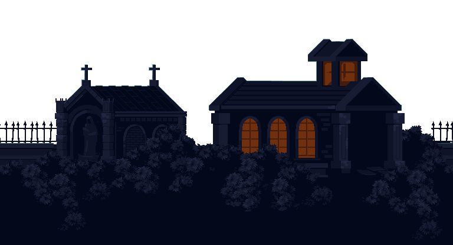
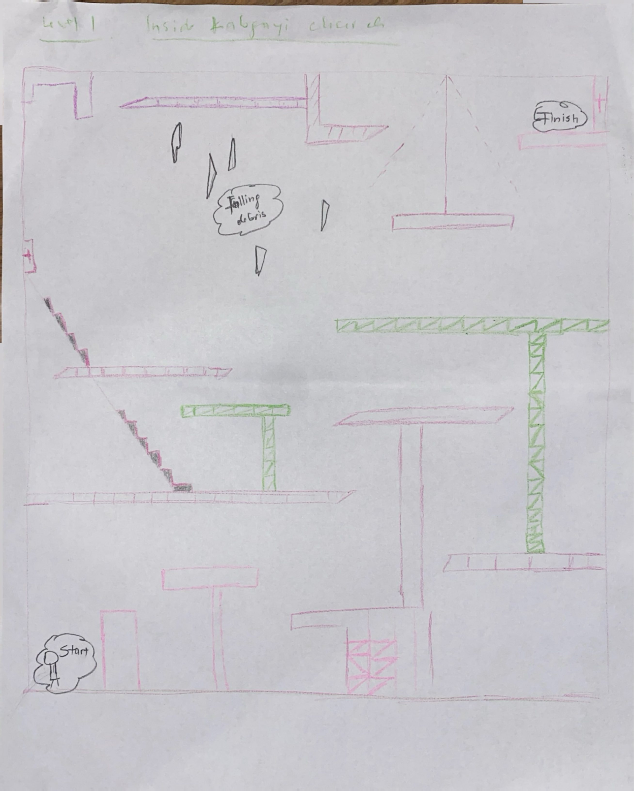
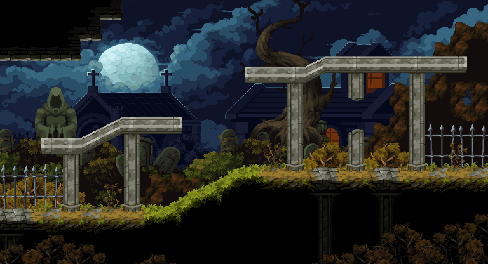

# GAME DESIGN DOCUMENT

## Table of Contents

- [Disclaimer](#disclaimer)
- [Working Title](#working-title)
- [Game Summary](#game-summary)
- [Inspiration](#inspiration)
- [Gameplay Overview](#gameplay-overview)
  - [Core Mechanics](#core-mechanics)
  - [Level Structure](#level-structure)
    - [Level 1: The Broken Sanctuary](#level-1-the-broken-sanctuary)
    - [Level 2: The Escape](#level-2-the-escape)
- [Theme Interpretation](#theme-interpretation)

---

**References:**
[Uimana Odile's Testimony](http://genocide.lib.usf.edu/node/1400)

---

## Disclaimer

This game is inspired by real events during the 1994 genocide against the Tutsi in Rwanda. It aims to honor the experiences of survivors and encourage reflection. Certain elements are simplified for gameplay purposes.

---

## Working Title

Crossing Kabgayi

---

## Game Summary

Crossing Kabgayi is a 2D narrative platformer game set during the 1994 genocide against the Tutsi in Rwanda. The player guides a young girl, Odile Umana, as she escapes the violence surrounding the Kabgayi Catholic Church and attempts to reach a safe zone protected by the Rwanda Patriotic Front (RPF).

Through 2 levels, players navigate fear, chaos, and uncertainty as they avoid militias while witnessing the destruction of communities and making their way toward survival. The game focuses on lived experiences, emphasizing vulnerability, resilience, and hope.

The objective is not simply to reach the safe place, but to experience the emotional journey of survival.

---

## Inspiration

- Survival accounts from the 1994 Genocide against the Tutsi.
- The testimonials of Odile Uwimana at Kabgayi Church.
- Historical role of the RDF in stopping the genocide and restoring hope in Rwandans.
- Games:
  - **This War of Mine:** Read about it on Wikipedia and watched trailers on YouTube (civilian survival)
  
  - **Valiant Hearts: The Great War** (history and emotion)
  

> "Survival stories carry both pain and hope, and must be remembered."

---

## Gameplay Overview

### Core Mechanics

- 2D platformer with camera (different camera types in level 1 and 2): Level one is played inside the church, so the camera type is vertical, while for level 2, which is outside of the church, the camera type is horizontal.
- Stealth (jump over blocks, avoid detection, move carefully)
- Puzzles (choosing the fastest and safest path, timing your movements)
- Narrative triggers (AV cues that tell the story)

### Level Structure

#### Level 1: The Broken Sanctuary

- Inside the Kabgayi church
- The goal is to exit the church
- Sounds and visuals imply violence without explicitly showing it

##### Level 1 Mechanics
- Player states:
  - **Single and double jump**
  - **Fall**
  - **Hit**
  - **Run**
  - **Wall jump**

<!--  -->
**Movement**
- Single and double jump
- Wall jump (for navigating the church's vertical interior)
- Run and fall states

**Stealth**
- Detection zones — militia/threat areas that trigger a "hit" state if entered
- Crouching or slow movement to avoid detection
- The Hit state implies a consequence system (damage, restart checkpoint)

**Puzzles**
- Vertical path choices — multiple routes up/through the church
- Timed movements (e.g. wait for a patrol to pass before jumping)
- Obstacles to jump over rather than engage

**Narrative Triggers**
- Audio cues (screams, gunshots off-screen) tied to position
- Visual cues (smoke, broken pews, bodies implied not shown) as the player climbs
- A trigger at the exit that transitions to Level 2

#### Level 2: The Escape

- Roads and countryside between Kabgayi and the safe zone
- Cross dangerous open areas
- The goal is to reach the safe zone
- Enemies shoot at you and you've to stay alive

##### Level 2 Mechanics
- Player states:
  - **Idle**
  - **Walk**
  - **Run**
  - **Single jump**

**Movement**
- Walk, run, single jump (no wall jump — open terrain)
- Idle state (hiding/pausing behind cover)

**Enemy Mechanics**
- Enemies that shoot projectiles toward the player
- No combat — Odile cannot fight back, only evade
- Cover system: objects to hide behind to avoid gunfire

**Stealth / Survival**
- Line-of-sight detection by enemies
- Safe zones or shadows to pass through undetected

**Narrative Triggers**
- Environmental storytelling along the road (destroyed homes, abandoned items)
- A final trigger reaching the RPF safe zone to end the game

---

## Cross-Level Design Notes

- The Hit state (Level 1) and being shot (Level 2) should both feed into a single shared health/lives system
- Narrative triggers in both levels should be positional and non-interruptive — they play out while the player can still move, keeping tension alive

---

## Theme Interpretation

This game is not about defeating enemies, but rather escaping and staying alive. Kabgayi church symbolizes how even places of refuge can become dangerous during conflicts. By playing as Odile, the audience experiences events through a vulnerable perspective. The presence of the RDF represents the possibility of safety and intervention. After playing the game, players should understand that the 1994 genocide against the Tutsi affected real people in deeply personal ways. They might feel empathy for survivors and recognize the importance of remembering history.
