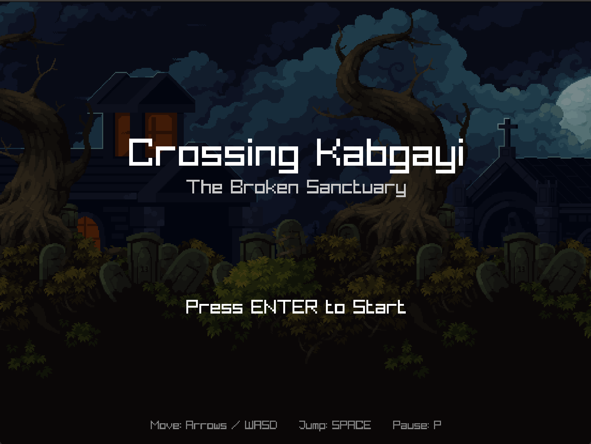
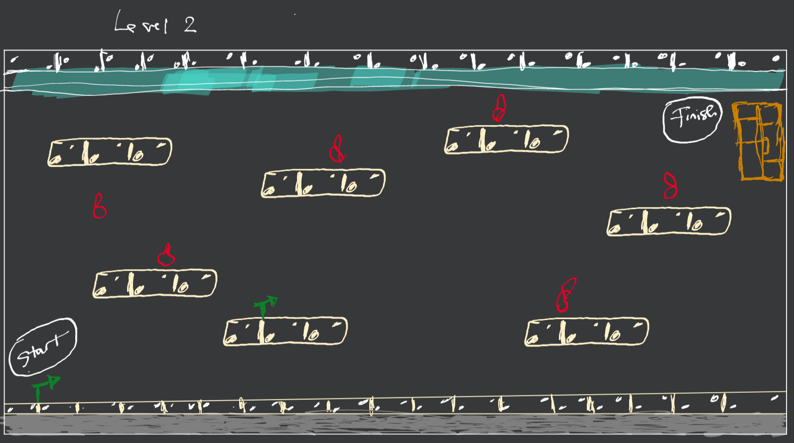
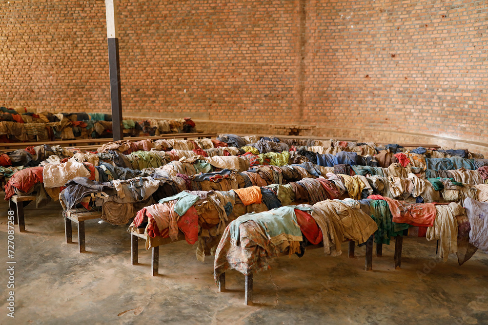
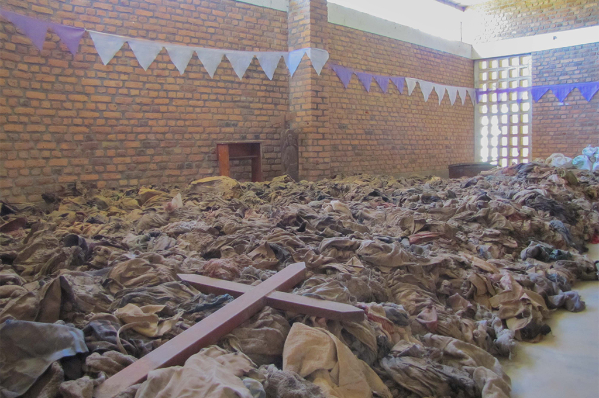
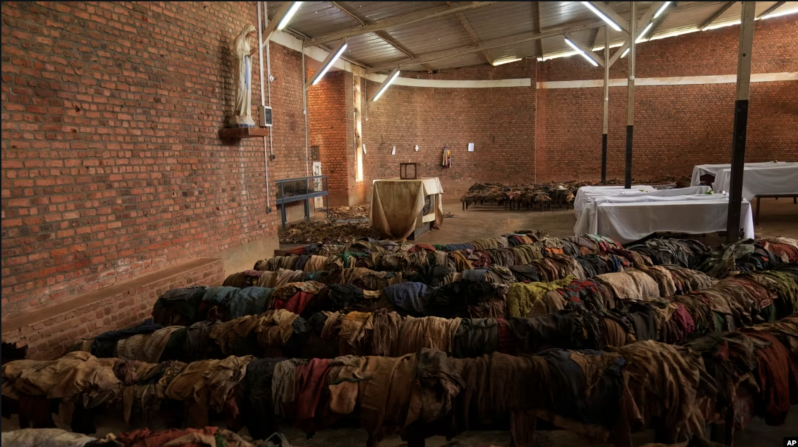
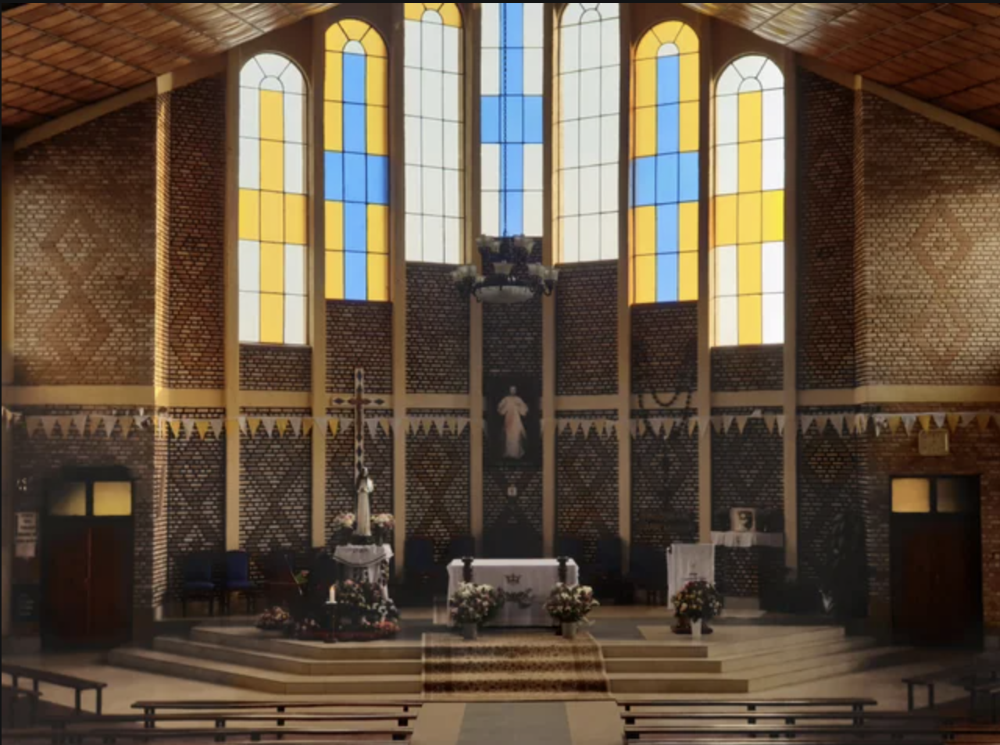
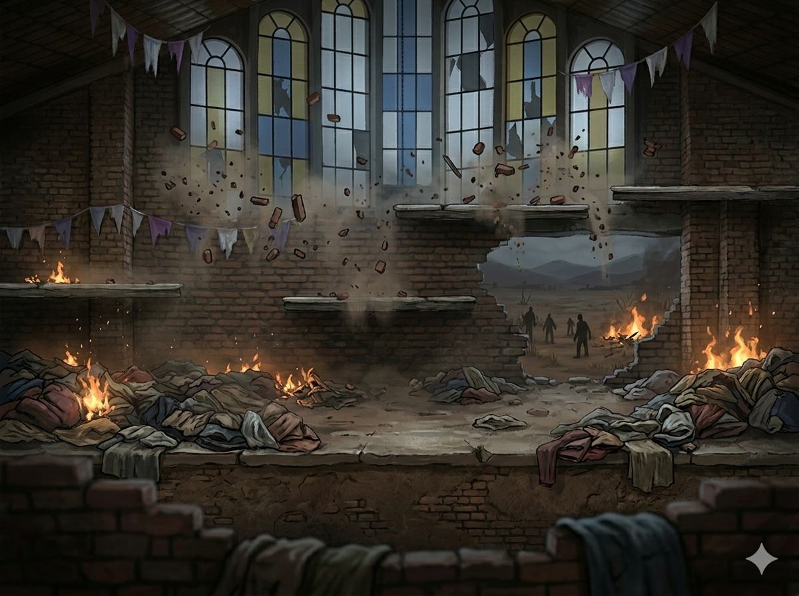

# GAME DESIGN DOCUMENT

  ## 
    Author: Edmond Nzivugira
  ## Game Title: CROSSING KABGAYI
  

  A video demosntrating a game demo can be found here: [Game Demo](https://drive.google.com/file/d/1r9jy5gCTiBmL9YC36nWy_Dh3Fsed86Gv/view?usp=sharing)

## Table of Contents

- [Disclaimer](#disclaimer)
- [Working Title](#working-title)
- [Game Summary](#game-summary)
- [Inspiration](#inspiration)
- [Gameplay Overview](#gameplay-overview)
  - [Core Mechanics](#core-mechanics)
  - [Level Structure](#level-structure)
    - [Level 1: The Broken Sanctuary](#level-1-the-broken-sanctuary)
    - [Level 2: The Escape](#level-2-the-escape)
- [Theme Interpretation](#theme-interpretation)

---

**References:**
[Uwimana Odile's Testimony](http://genocide.lib.usf.edu/node/1400)

---

## Disclaimer

This game is inspired by real events during the 1994 genocide against the Tutsi in Rwanda. It aims to honor the experiences of survivors and encourage reflection. Certain elements are simplified for gameplay purposes.

---

## Game Summary

Crossing Kabgayi is a 2D narrative platformer game set during the 1994 genocide against the Tutsi in Rwanda. The player guides a young girl, Odile Uwimana, as she escapes the violence surrounding the Kabgayi Catholic Church and attempts to reach a safe zone protected by the Rwanda Patriotic Front (RPF).

Through 2 levels, players navigate fear, chaos, and uncertainty as they avoid militias while witnessing the destruction of communities and making their way toward survival. The game focuses on lived experiences, emphasizing vulnerability, resilience, and hope.

The objective is not simply to reach the safe place, but to experience the emotional journey of survival.

---

## Inspiration

- Survival accounts from the 1994 Genocide against the Tutsi.
- The testimonials of Odile Uwimana at Kabgayi Church.
- Historical role of the RPF in stopping the genocide and restoring hope in Rwandans.
- Games:
  - **This War of Mine:** Read about it on Wikipedia and watched trailers on YouTube (civilian survival)
  
  - **Valiant Hearts: The Great War** (history and emotion)
  

> "Survival stories carry both pain and hope, and must be remembered."

---

## Gameplay Overview

### Core Mechanics

- 2D side-scrolling platformer with a scrolling Camera2D that follows the player
- Level 1 is played outdoors (the cemetery grounds around Kabgayi) with a horizontal camera and parallax background layers
- Level 2 is played inside the church with a fixed interior background and vertical platform layout
- Evasion (jump over obstacles, duck behind solid tiles to avoid bullets)
- Puzzles (choosing the fastest and safest path, timing movements around enemy fire)

### Level Structure

#### Level 1: The Cemetery Grounds

- Odile navigates the open cemetery grounds surrounding the Kabgayi church
- The goal is to find the **key** hidden on the highest platform in the top-right corner and collect it to proceed inside
- Apple collectibles are scattered across the platforms — gathering them builds score and represents small acts of survival
- A single enemy shooter fires bullets toward the player every 2 seconds; solid tiles provide cover
- The 4-layer parallax background creates a sense of depth and urgency as the player moves right

##### Level 1 Mechanics
- Player states: **Idle**, **Run**, **Jump**, **Double Jump**, **Fall**, **Hit**

**Movement**
- Horizontal side-scrolling across a 16-row × 50-column tile grid
- Single and double jump to reach elevated platforms
- Run and fall states with gravity

**Survival**
- Bullets aimed at the player's current position — anticipate and move
- Hide underneath solid tiles to block incoming fire
- Health carries over into Level 2 — taking damage here has lasting consequences

**Win Condition**
- Reach the key on the top-right platform to unlock the church and advance to Level 2

#### Level 2: The Church Interior

- Odile has entered the Kabgayi church, now a dangerous and chaotic space
- The goal is to navigate the interior platforms and reach the **door** in the top-right corner to escape
- Two enemy shooters fire from different positions, creating crossfire across the level
- Directional pointer signs guide the player toward the exit

##### Level 2 Mechanics

- Player states: **Idle**, **Run**, **Jump**, **Double Jump**, **Fall**, **Hit**

**Movement**
- Vertical platform layout inside a 20-row × 50-column enclosed dungeon
- Solid ceiling, floor, and side walls contain the player within the church space
- Single and double jumps to navigate staggered platforms

**Enemy Mechanics**
- Two shooters fire projectiles aimed at the player's position
  - Shooter 1 fires every 2.5 seconds; Shooter 2 fires every 3.5 seconds with a staggered start
  - Projectiles travel anywhere on screen except beneath solid tiles
- No combat — Odile cannot fight back, only evade
- Hide underneath platforms to block incoming fire

**Survival**
- Health carries over from Level 1 — arriving injured means less margin for error
- Each bullet hit deals 10 HP; health reaching 0 ends the game

**Win Condition**
- Reach the door at the top-right corner of the church to escape and complete the game

---

## Cross-Level Design Notes

- The Hit state (Level 1) and being shot (Level 2) should both feed into a single shared health/lives system
- Narrative triggers in both levels should be positional and non-interruptive — they play out while the player can still move, keeping tension alive

---

## Theme Interpretation

This game is not about defeating enemies, but rather escaping and staying alive. Kabgayi church symbolizes how even places of refuge can become dangerous during conflicts. By playing as Odile, the audience experiences events through a vulnerable perspective. The presence of the RDF represents the possibility of safety and intervention. After playing the game, players should understand that the 1994 genocide against the Tutsi affected real people in deeply personal ways. They might feel empathy for survivors and recognize the importance of remembering history.

---
## 2 Key Mechanincs
 > **Double Jump**
  Pressing the space bar or double pressing on the UP arrow arrows the character sprite to double jump. This is useful especially when the player wants to reach hire platforms. This mechanic is implemented by setting the minimum jump count to 0 and the maximum to 2. The jump logic reads keyboard inputs and the moment an UP arrow or a space bar is read, the jump_count is incremented by one, as long as it is less than 2. It's possible for the character to do more double jumps on the top of the previous double dumps, which might make you feel like it's a quadruple jump, but it's not. Let's say a player does a double jump but then realizes that the character didn't reach where they wanted them to be. While the character is still midair, the player then decides to do another double jump before the character transition into the `falling` phase. This will allow the character to do two more jumps (a double-jump) by reseting the jump count to zero.

 > **Parallax Effect**
  The parallax effect is one of the best GUI design choices that I've seen implemented in 2d platformer games. Given tqo or more layers, it's possible to animate them to have a background that moves with the player. Let's suppose we have 3 layers that we want to use to design our background look. To make them move in parallax, we give them different `scroll_factors`. Let's suppose we give `layer A` a scroll_factor of `0.5`,  `layer B` a scroll_factor of `0.75`, and to `layer C` a scroll_factor of `1.2`. Each layer moves at scroll_factor * camera_x so farther layers (small factor) scroll slower than closer ones (large factor), creating depth.

## Artistic Section
> Some of the images used in the game were generated or enhance using AI, specifically Gemini. The image used for the Kabgayi church interior was made by combining the following three images and prompt:
  - Prompt: I want to create an 800 x 600 image to use as a background for my 2d platform game. Using the above three images as a reference, create an image that depicts the horrors of the 1994 genocide against the tutsi in Rwanda. The image should include elements like clothes, skulls, and anything that symbolizes violence and terror.

<table>
  <tr>
    <td></td>
    <td></td>
    <td></td>
    <td></td>
  </tr>
</table>

And that resulted into the following background image for the second level of my game:

> The music used was downloaded from Artlist.com, but I also used Davinci Resolve Fairlight editing software to enhance and mix the audio with sound effects to match the theme and dwhat was going on in the game. 

## CREDITS

  - `Double Jump Mechanic`: [Double Jump](https://gamemaker.io/en/tutorials/platformer-double-jump)
  - `Parallax effect`: Class code - teh second in-class mini-hackathon
  - `Music and SFX`: [Artlist](https://artlist.io/) 
  - `Images`: [sample images](https://natarajasfoot.blogspot.com/2015/08/nyamata.html)
  - `Sprite sheets`: [Pixel Frog](https://pixelfrog-assets.itch.io/)
  - `COSC481 Playful Thinking, Serious Coding at Colgate University`

